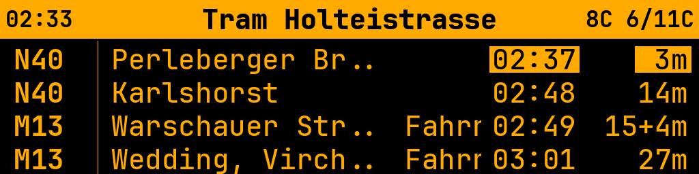
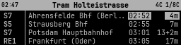
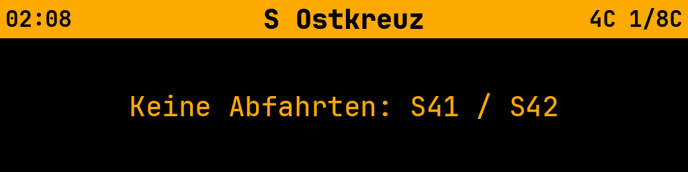

# BVG Abfahrtsanzeige (Departure Display)

A Python application that displays real-time Berlin BVG train departures. It fetches data from the BVG Transport REST API and renders an amber-on-black departure board.

Supports two display modes: a **Pygame window** for local development and a **SSD1322 OLED** (256x64, 4-bit grayscale) for hardware deployment on a Raspberry Pi Zero.

Multi-station rotation, live weather, per-station line filtering, hurry-zone blinking, and more.



**SSD1322 OLED (256x64)** - Pi Zero hardware



**No departures** - when filtered lines have no upcoming departures



## Requirements

- Python 3.12+
- Internet connection (BVG API for departures, Open-Meteo for weather)

## Installation

```bash
# Clone the repository
git clone <repo-url>
cd infodisplay

# Install for local development (Pygame window)
pip install -e ".[dev]"

# Install for Pi Zero hardware (SSD1322 OLED)
pip install -e ".[hardware]"
```

## Usage

```bash
# Run the live departure display (Pygame window, default config.yaml)
python -m infodisplay

# Use a specific config file
python -m infodisplay --config config.hardware.yaml

# Run in fullscreen mode
python -m infodisplay --fullscreen

# Override to a single station (no rotation)
python -m infodisplay --station-id 900100003

# Search for a station ID
python -m infodisplay --search "Alexanderplatz"

# Fetch live departures and print to terminal
python -m infodisplay --fetch-test

# Render a test image to assets/ (uses config for size/fonts)
python -m infodisplay --render-test
python -m infodisplay --config config.hardware.yaml --render-test

# Enable debug logging
python -m infodisplay --debug

# Custom refresh and rotation intervals
python -m infodisplay --refresh 15 --rotation 5
```

Press **ESC** or close the window to quit (Pygame mode).

### CLI Flags

| Flag | Description |
|------|-------------|
| `--config PATH` | Path to YAML config file (default: `config.yaml`) |
| `--station-id ID` | Single station mode (skips rotation) |
| `--fullscreen` | Run in fullscreen |
| `--refresh N` | Refresh interval in seconds |
| `--rotation N` | Rotation interval in seconds |
| `--search "name"` | Search for a station by name |
| `--fetch-test` | Print live departures to stdout |
| `--render-test` | Save a test render to `assets/test_output_<mode>.png` |
| `--debug` | Enable debug-level logging |

## Configuration

Edit `config.yaml` in the project root. All sections are optional - defaults are used for anything omitted.

```yaml
stations:                           # Stations to rotate between
  - id: "900120013"                 # BVG station ID (use --search to find)
    name: "Tram Holteistrasse"      # Display name (auto-resolved if empty)
    walking_minutes: 5              # Walking time in minutes (for hurry-zone)
  - id: "900120009"
    name: "U Samariterstrasse"
    walking_minutes: 10
  - id: "900120003"
    name: "S Ostkreuz"
    walking_minutes: 10
    lines: ["S41", "S42"]           # Only show these lines (optional)

rotation:
  interval_seconds: 10              # Seconds per station before switching

display:
  mode: pygame                      # "pygame" (window) or "ssd1322" (hardware OLED)
  width: 1024                       # Window/display width in pixels
  height: 256                       # Window/display height in pixels
  fullscreen: false
  fps: 60
  background_color: [0, 0, 0]      # RGB black
  text_color: [255, 170, 0]        # RGB amber
  show_remarks: false               # Toggle remarks column

refresh:
  interval_seconds: 30              # How often to fetch new departure data
  departure_count: 20               # Max departures to request from API

filters:                            # Transport types to include
  suburban: true                    # S-Bahn
  subway: true                      # U-Bahn
  tram: true                        # Tram / MetroTram
  bus: true                         # Bus
  ferry: false                      # Ferry
  express: true                     # Express (RE, RB)
  regional: true                    # Regional

fonts:                              # Font configuration (optional)
  font_header: "Transit_Wide_Bold.ttf"
  font_main: "Transit_Bold.ttf"
  font_remark: "Transit_Condensed_Normal.ttf"
  station_name_size: 20
  header_size: 13
  departure_size: 18
  remark_size: 13

weather:                            # Weather display (optional)
  latitude: 52.5170                 # Coordinates (default: Berlin Friedrichshain)
  longitude: 13.4540
  refresh_seconds: 600              # Cache duration (10 minutes)
```

## Features

### Multi-Station Rotation

Configure multiple stations and the display rotates between them automatically. Rotation is scroll-gated - it waits for any scrolling remarks to finish before switching. Override to a single station with `--station-id`.

### Per-Station Line Filtering

Add an optional `lines` list to any station to show only specific lines. For example, at Ostkreuz you might only care about the Ringbahn:

```yaml
- id: "900120003"
  name: "S Ostkreuz"
  lines: ["S41", "S42"]
```

When `lines` is omitted or empty, all departures (matching global filters) are shown.

### Weather Display

Current temperature, daily low/high, and 12-hour precipitation forecast are shown in the station header bar. Uses the Open-Meteo API (free, no API key required). Refreshes every 10 minutes by default.

### Hurry-Zone Blinking

Departures within a "hurry zone" blink their time columns to signal you might still catch the train if you hurry. The hurry zone is `walking_minutes - 3` to `walking_minutes`. For example, with `walking_minutes: 10`, departures arriving in 7–10 minutes will blink. Departures below the hurry threshold are filtered out entirely.

### Line Prefixes

- Tram lines are prefixed with **M** (MetroTram branding): `21` → `M21`
- Bus lines are prefixed with **B**: `240` → `B240`

### Departure Time Column

Each row shows the actual departure time as HH:MM (planned time + delay), alongside the minutes-until countdown.

### Delay Display

Delayed departures show the delay as `+Xmin` next to the minutes-until value.

### Remarks Toggle

Set `show_remarks: false` in the display config to hide the remarks column and give more space to the destination column. When enabled, long remarks scroll horizontally with a pause at each end.

### Transport Type Filters

Toggle which transport types to include globally via the `filters` section: S-Bahn, U-Bahn, tram, bus, ferry, express, and regional.

### Dynamic Font Scaling

All font sizes and padding scale dynamically based on display height (`height / 128`), so the layout works at any resolution.

## Hardware Setup (Pi Zero + SSD1322)

### Hardware Requirements

- Raspberry Pi Zero W (or any Pi with SPI)
- SSD1322 OLED display (256x64, SPI interface)
- SPI wiring between the Pi and display

### Installation on Pi Zero

```bash
# Enable SPI
sudo raspi-config  # Interface Options → SPI → Enable

# Install with hardware dependencies
pip install -e ".[hardware]"
```

This installs `luma.oled`, which provides the SSD1322 driver over SPI.

### Hardware Configuration

Use the included `config.hardware.yaml` profile, or create your own with `mode: ssd1322`:

```yaml
display:
  mode: ssd1322
  width: 256
  height: 64
  fps: 10
  show_remarks: false
```

Font sizes scale automatically based on display height. The hardware config uses smaller sizes appropriate for 256x64.

### Running

```bash
# Run on hardware
python -m infodisplay --config config.hardware.yaml

# Preview what the hardware display will look like
python -m infodisplay --config config.hardware.yaml --render-test
```

The SSD1322 is a 4-bit grayscale OLED - the amber RGB colors are automatically converted to grayscale. On hardware, there are no GUI events (no ESC key); stop with Ctrl+C or manage via systemd.

### Display Modes

| Mode      | Display              | Use Case                    |
|-----------|----------------------|-----------------------------|
| `pygame`  | Pygame window        | Local development, desktop  |
| `ssd1322` | SSD1322 OLED via SPI | Pi Zero hardware deployment |

Both modes use the same PIL-based renderer. The display backend is selected by the `mode` field in the config, with lazy imports so Pygame machines don't need `luma.oled` and vice versa.

## Architecture

```
BVG REST API  →  api.py (BVGClient)
                    │
                    ▼
                 models.py (Departure, StationContext)
                    │
                    ▼
                 app.py (InfoDisplayApp)
                ╱   │   ╲
               ▼    ▼    ▼
      renderer.py  display    weather.py
      (PIL Image)  backends   (Open-Meteo)
                   ╱    ╲
         display.py    ssd1322_display.py
         (Pygame)      (luma.oled)
```

| Module | Purpose |
|--------|---------|
| `config.py` | Three-layer config loading: defaults → YAML → CLI args |
| `models.py` | `Departure` dataclass with `minutes_until` and `delay_minutes` properties; `StationContext` for per-station state; `parse_departure()` parser with line prefix logic |
| `api.py` | `BVGClient` wrapping the BVG Transport REST API v6 (departures, station search, name lookup) |
| `renderer.py` | `DepartureRenderer` producing a PIL Image with column layout, dynamic scaling, scrolling text, and blink effects |
| `display.py` | `DepartureDisplay` managing the Pygame window and keyboard/quit events |
| `ssd1322_display.py` | `SSD1322Display` driving the SSD1322 OLED via SPI using `luma.oled` |
| `app.py` | `InfoDisplayApp` orchestrating multi-station rotation, per-station refresh, weather fetching, filtering, and the main loop |
| `weather.py` | `WeatherData` dataclass and `fetch_weather()` using the Open-Meteo free API |

## Project Structure

```
infodisplay/
├── config.yaml                   # Pygame development config
├── config.hardware.yaml          # Pi Zero + SSD1322 hardware config
├── pyproject.toml                # Build and dependency config
├── README.md
│
├── src/infodisplay/              # Source code
│   ├── __init__.py
│   ├── __main__.py               # Entry point and CLI routing
│   ├── config.py                 # Configuration loading
│   ├── models.py                 # Data models and parsing
│   ├── api.py                    # BVG API client
│   ├── renderer.py               # PIL image rendering
│   ├── display.py                # Pygame display backend
│   ├── ssd1322_display.py        # SSD1322 OLED display backend
│   ├── app.py                    # Main orchestrator
│   └── weather.py                # Weather client
│
├── fonts/                        # FF Transit typefaces
│   ├── Transit_Bold.ttf
│   ├── Transit_Condensed_Normal.ttf
│   └── Transit_Wide_Bold.ttf
│
└── tests/                        # Test suite
    ├── conftest.py               # Shared fixtures
    ├── test_config.py
    ├── test_models.py
    ├── test_api.py
    └── test_renderer.py
```

## Running Tests

```bash
python -m pytest tests/ -v
```

## API Attribution

- [BVG Transport REST API v6](https://v6.bvg.transport.rest) - free, no authentication required, rate limit 100 requests/minute
- [Open-Meteo API](https://open-meteo.com/) - free weather API, no API key required

## Fonts

Uses the **FF Transit** typeface family - the official typeface of BVG (Berliner Verkehrsbetriebe). Three variants are included in the `fonts/` directory: Transit Wide Bold, Transit Bold, and Transit Condensed Normal.
